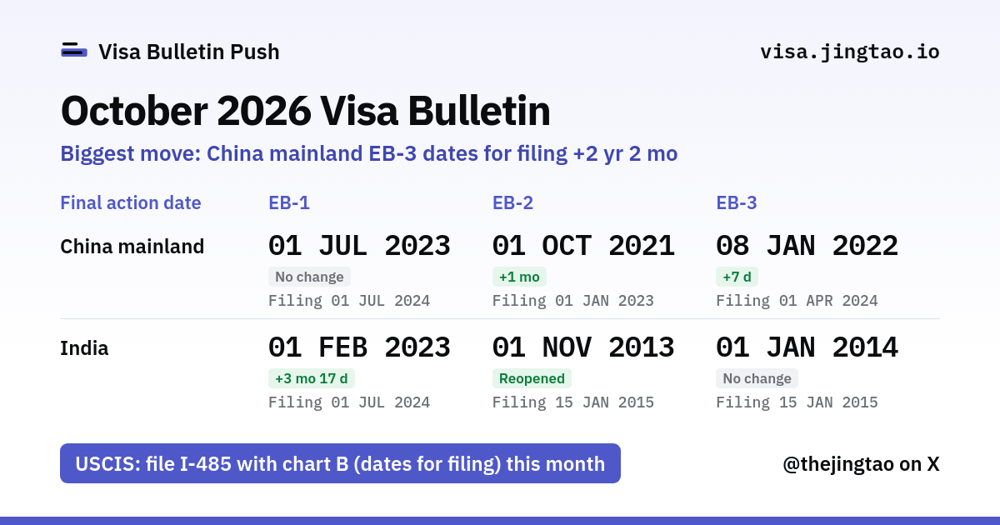

# Visa Bulletin Push

Is your priority date current yet? When chart A or chart B of the Visa Bulletin reaches it, Visa Bulletin Push has your ChatGPT, Grok Bot or any webhook tell you. For China and India EB-1, EB-2 and EB-3; setup is one sentence to your agent.

Free and open source. The whole thing runs on one Cloudflare Worker on the free plan.

**Try it: [visa.jingtao.io](https://visa.jingtao.io)**



## Why this exists

If you were born in China or India and are waiting for an employment-based green card, two dates decide your year: the final action date and the date for filing. The State Department publishes both once a month, in a PDF called the Visa Bulletin. Then, on a different website, USCIS says which of the two charts you may use to file I-485 that month.

So every month people refresh two government sites, find their row in a PDF table, and work out which chart applies.

Asking an AI agent doesn't fix this. It can search, but it can't tell whether what it found is this month's bulletin (travel.state.gov blocks most automated visitors, so agents often read an old copy). And you still have to remember to ask, which is no better than opening the website yourself.

What you want is to be told. Visa Bulletin Push reads both sources, and when your row moves it pushes the news to you or your agent. Agents can take pushes now, though few people know it: ChatGPT dots and Work chats accept MCP Events, and a Grok Bot routine runs when a webhook arrives. Any agent that can receive a webhook works, so each agent that adds push support works with it too.

## Use it

**On the web.** Open [visa.jingtao.io](https://visa.jingtao.io) and pick your country, category and priority date. You get this month's answer and how far your date moved.

**Pushed to your AI agent.** Paste one sentence:

> Read https://visa.jingtao.io/setup.md and set up Visa Bulletin alerts for me.

The agent asks for your category and priority date, subscribes itself and sends you a test alert with this month's dates, so you see it working today instead of at the next bulletin. It works with Grok Bot, ChatGPT (dots and Work chats, through MCP Events), Claude Code, and any agent that can receive a webhook. To stop, tell it "stop my visa bulletin alerts".

**From code.** A JSON API, signed webhooks, an Atom feed and an MCP server: [docs/REFERENCE.md](docs/REFERENCE.md).

## Run your own

[](https://deploy.workers.cloudflare.com/?url=https://github.com/jt-wang/visa-bulletin-push)

The button copies this repository into your GitHub account, creates the database and the delivery queue on your Cloudflare account, asks for two secrets (the form says how to generate each) and deploys. Everything fits in the Workers Free plan.

Or let your coding agent do it. Tell Claude Code, Codex or a similar agent:

> Clone https://github.com/jt-wang/visa-bulletin-push and deploy it to my Cloudflare account by following AGENTS.md.

[AGENTS.md](AGENTS.md) lists every step and how to check each one.

## How it works

```
Cron, every minute -> due? (every 3 min while a bulletin is expected, hourly otherwise)
  |
  |- HEAD the official bulletin PDF -> new or changed? parse it, check every cell against the official web page
  |- read the USCIS filing-charts page -> which chart applies this month
  |
  '- store the snapshot in D1 -> events -> Queue -> signed webhooks and MCP Events (ChatGPT)
                                        '-> share card, rendered by Browser Run
```

- No AI in the pipeline. The dates come from parsing the official PDF, and every cell is checked against the official web page.
- No servers to run. One Worker, D1, one Queue, and Browser Run for the share card, all inside the free plan's limits (10 ms CPU per request; measured numbers in the [reference](docs/REFERENCE.md#free-plan-budget)).
- Polite to the sources: public pages only, no login, no challenge solving, a few requests an hour, and a `User-Agent` that names the project. Details in [Sources and access](docs/REFERENCE.md#sources-and-access).
- Stores almost nothing. For webhook alerts: the webhook URL your agent receives alerts at, the events you chose and an encrypted token. No names, emails, home addresses or priority dates.

## Contributing

Issues and pull requests are welcome. `npm test` runs 230+ tests in a few seconds; run it and `npm run typecheck` before you open a pull request. [AGENTS.md](AGENTS.md) has the conventions.

Unofficial and not legal advice. Always check the [State Department Visa Bulletin](https://travel.state.gov/content/travel/en/legal/visa-law0/visa-bulletin.html) and the [USCIS filing charts](https://www.uscis.gov/green-card/green-card-processes-and-procedures/visa-availability-priority-dates/adjustment-of-status-filing-charts-from-the-visa-bulletin).

## 中文说明

美国签证排期推送：中国大陆、印度出生的职业移民 EB-1、EB-2、EB-3，表A（最终行动日期）、表B（递交申请日期），以及 USCIS 本月让职业移民 I-485 用哪张表。

- 网页：[visa.jingtao.io](https://visa.jingtao.io)。选出生地、类别、优先日，直接告诉你这个月能不能递。
- 为什么是推送：AI 自己查，分不清查到的是不是最新一期，而且你还得记得去问，这跟自己打开网站没区别。排期一动，这里就推给你的 agent。ChatGPT 的 dot 和 Work 对话已经能接收 MCP 推送，Grok Bot 的 routine 能被 webhook 触发，很多人还不知道。
- 推给你的 AI agent：把这句话贴给它，「读一下 https://visa.jingtao.io/setup.md ，帮我设置美国签证排期推送。」它会问你的类别和优先日、自己订阅，然后马上发你一条带本月排期的测试推送。支持 Grok Bot、ChatGPT、Claude Code，以及任何能接收 webhook 的 agent。
- 自己部署：点上面的 Deploy to Cloudflare，或者让你的编程 agent 按 [AGENTS.md](AGENTS.md) 做。Cloudflare 免费版就够用。
- 技术细节：[docs/REFERENCE.md](docs/REFERENCE.md)。

非官方整理，非法律意见，以美国国务院与 USCIS 原文为准。

## License

MIT
